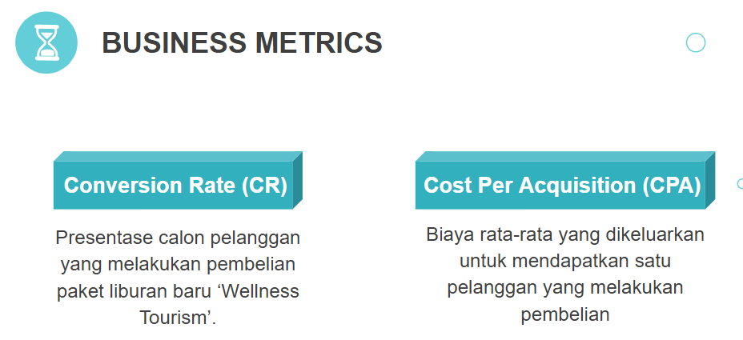

# Travel-Customer-Prediction

## Web Application

https://travel-purchase-predictor.streamlit.app/

# About Dataset

Dataset berasal dari situs [Kaggle](https://www.kaggle.com/datasets/susant4learning/holiday-package-purchase-prediction).

### Context

Perusahaan "Trips & Travel.Com" berkeinginan untuk memperluas basis pelanggannya dengan memperkenalkan berbagai tawaran paket baru. Saat ini, ada 5 jenis paket yang ditawarkan oleh perusahaan - Basic, Standard, Deluxe, Super Deluxe, dan King. Dari data tahun lalu, 18% pelanggan membeli paket-paket tersebut. Namun, biaya pemasaran cukup tinggi karena pelanggan dihubungi secara acak tanpa mempertimbangkan informasi yang tersedia. Kini, perusahaan berencana meluncurkan produk baru yaitu Wellness Tourism Package. Tujuannya adalah untuk memanfaatkan data yang ada agar biaya pemasaran lebih efisien.

### Content

### Tasks To Solve

Analisis data pelanggan diperlukan untuk memberikan rekomendasi kepada pembuat kebijakan dan tim pemasaran. Selain itu, model prediksi perlu dibangun untuk menentukan pelanggan potensial yang akan membeli paket liburan Wellness Tourism Package yang baru diperkenalkan.

### Business Metrics

## Table of Contents

1. [Insight and Recommendation From EDA](#1-insight-and-recommendation-from-eda)
   - [Descriptive Statistics](#1-descriptive-statistics)
   - [Univariate Analysis](#2-univariate-analysis)
   - [Multivariate Analysis: Korelasi Fitur-Label](#3a-multivariate-analysis-korelasi-fitur-label)
   - [Multivariate Analysis: Korelasi antar Fitur](#3b-multivariate-analysis-korelasi-antar-fitur)
   - [Business Insight](#4-business-insight)
2. [Data Preprocessing](#2-data-preprocessing)
   - [Data Cleansing](#1-data-cleansing)
     - [Handle missing values](#a-handle-missing-values)
     - [Handle duplicated data](#b-handle-duplicated-data)
     - [Handle outliers](#c-handle-outliers)
     - [Feature transformation](#d-feature-transformation)
     - [Feature encoding](#e-feature-encoding)
     - [Handle class imbalance](#f-handle-class-imbalance)
   - [Feature Engineering](#2-feature-engineering)
     - [Feature selection](#a-feature-selection)
     - [Feature extraction](#b-feature-extraction)
     - [Feature Tambahan](#c-feature-tambahan)
3. [Modeling (Supervised - Classification)](#3-modeling-supervised---classification)
   - [Modeling](#1-modeling)
     - [Split Data Train & Test](#a-split-data-train--test)
     - [Modeling](#b-modeling)
     - [Model Evaluation: Pemilihan dan perhitungan metrics model](#c-model-evaluation-pemilihan-dan-perhitungan-metrics-model)
     - [Model Evaluation: Validasi dengan cross-validation](#d-model-evaluation-validasi-dengan-cross-validation)
     - [Hyperparameter Tuning](#e-hyperparameter-tuning)
   - [Feature Importance](#2-feature-importance)
     - [Feature Importance Evaluation](#a-feature-importance-evaluation)
     - [Business Insight](#b-business-insight)
     - [Business Recommendation](#c-business-recommendation)
     - [Revenue Simulation](#d-revenue-simulation)
# 1. Insight and Recommendation From EDA

### 1. Descriptive Statistics:

Insight:
Ada 8 kolom dengan nilai null, termasuk DurationOfPitch dan TypeOfContact sebagai kolom dengan jumlah nilai null paling banyak.
Outliers dan distribusi yang skew terdeteksi di kolom DurationOfPitch, NumberOfTrips, dan MonthlyIncome.
Terdapat kesalahan entri data pada kolom Gender ("Fe Male") dan ambiguitas di kolom MaritalStatus ("Unmarried").

Rekomendasi Preprocessing:
Untuk kolom dengan nilai null, strategi imputasi perlu diterapkan. Untuk kolom numerik bisa menggunakan median dan untuk kategorikal bisa menggunakan mode.
Kesalahan entri pada kolom Gender harus dikoreksi dari "Fe Male" menjadi "Female".
Gabungkan kategori "Unmarried" ke dalam "Single" pada kolom MaritalStatus.

### 2. Univariate Analysis:

Insight:
Ketidakseimbangan kelas sangat signifikan pada kolom target ProdTaken, ini bisa mempengaruhi performa model.
Kolom DurationOfPitch dan MonthlyIncome memiliki distribusi yang skew ke kanan, menunjukkan adanya outliers yang bisa mempengaruhi model.

Rekomendasi Preprocessing:
Untuk mengatasi ketidakseimbangan kelas pada ProdTaken, teknik SMOTE atau oversampling bisa digunakan.
Transformasi logaritmik atau metode penanganan outliers lainnya perlu diterapkan pada kolom dengan distribusi yang skew.

### 3a. Multivariate Analysis: Korelasi Fitur-Label:

Insight:
Age dan MonthlyIncome menunjukkan korelasi yang lebih tinggi dengan ProdTaken, ini menandakan kedua fitur ini bisa jadi penting dalam pemodelan.

Rekomendasi Preprocessing:
Hapus kolom CustomerID dari dataset karena tidak memberikan informasi yang berguna untuk pemodelan.
Pertahankan fitur seperti Age dan MonthlyIncome yang menunjukkan korelasi tinggi dengan label.

### 3b. Multivariate Analysis: Korelasi antar Fitur:

Insight:
Tidak ada fitur yang menunjukkan korelasi yang sangat tinggi satu sama lain, ini menandakan bahwa setiap fitur memberikan informasi yang berbeda dan bisa jadi penting untuk pemodelan.

Rekomendasi Preprocessing:
Tidak perlu drop fitur hanya berdasarkan korelasi antar-fitur, karena korelasi rendah menunjukkan bahwa fitur-fitur tersebut bisa memberikan informasi yang berbeda dalam model.

### 4. Business Insight:
Insight 1: Produk "Basic" adalah yang paling sering dibeli oleh pelanggan. Ini menunjukkan tingkat penerimaan produk ini yang tinggi di pasar.
Rekomendasi Bisnis: Fokus pemasaran lebih pada produk "Basic" dengan membuat penawaran atau diskon khusus.

Insight 2: Pelanggan yang sudah menikah lebih cenderung untuk membeli produk. Ini bisa jadi karena kebutuhan akan paket liburan keluarga.
Rekomendasi Bisnis: Tawarkan paket khusus keluarga atau diskon untuk menarik segmen pelanggan ini.

Insight 3: Kepemilikan paspor berkolerasi dengan kecenderungan untuk membeli paket. Ini menunjukkan pelanggan ini lebih terbuka untuk paket yang melibatkan perjalanan lintas negara. 
Rekomendasi Bisnis: Buat penawaran khusus untuk pelanggan dengan paspor, seperti diskon atau paket eksklusif.

# 2. Data Preprocessing

## 1. Data Cleansing:
### A. Handle missing values
  Mengatasi missing value dalam dataset sangat penting karena nilai yang hilang dapat mengakibatkan bias dan ketidakakuratan dalam hasil analisis. Kami mengatasi missing value dalam dataset dengan melakukan imputasi. Hal ini dilakukan karena persentasenya kecil. Selanjutnya, kami menggunakan nilai mean untuk data numerik dengan distribusi yang normal (Age, NumberOfFollowUps, NumberOfChildrenVisiting), nilai median untuk data numerik dengan distribusi yang tidak normal atau skew (DurationOfPitch, NumberOfTrips, MonthlyIncome), dan nilai modus untuk data kategorik (TypeOfContact, PreferedPropertyStar). Dengan metode ini, dataset menjadi lebih lengkap dan siap untuk analisis lebih lanjut.

### B. Handle duplicated data
- Handle Duplicated Data sangat penting karena data duplikasi dapat mempengaruhi akurasi data serta mengganggu efisiensi sistem pengolahan data.  Menghandle duplikasi data meningkatkan akurasi, efisiensi, keamanan, dan kemampuan organisasi/perusahaan untuk mengambil keputusan berdasarkan data yang tepat dan bersih.
- Diketahui dalam dataframe tidak terdapat duplikasi data, sehingga menghandle kesalahan pada kolom Gender (Fe Male digabungkan ke Female), serta handle kolom MaritalStatus (Unmarried digabungkan ke Single). 
- Pada kolom Gender, terdapat kesalahan input yaitu 'Fe Male'. Sedangkan terdapat juga jawaban 'Female' sehingga untuk mencegah duplikat data 'Fe Male' digabungkan ke 'Female'. 
- Pada kolom MaritalStatus, terdapat data yang tidak konsisten yaitu Unmarried, sehingga Unmarried digabungkan ke Single karena keduanya merujuk kepada istilah yang sama, yaitu lajang.

### C. Handle outliers
- Dari EDA yang sudah dilakukan pada minggu sebelumnya, diketahui bahwa kolom DurationOfPitch, NumberOfTrips, MonthlyIncome memiliki outliers.
- Kolom MonthlyIncome memiliki distribusi yang kemiringannya (skew) cukup signifikan, maka dilakukan log-transform agar distribusinya lebih simetris.
- Mengidentifikasi outliers menggunakan metode z-score dan menetapkan outliers rendah dan tinggi sebagai acuan dalam meng-handle outliers.
- Mengganti nilai outliers dengan ketentuan: Nilai outliers rendah diganti menjadi nilai batas bawah yang belum termasuk outlier dan nilai outliers tinggi diganti menjadi nilai batas atas yang belum termasuk outlier.

### D. Feature transformation
  Transformasi fitur logaritma (log transform) adalah teknik yang berguna untuk mengatasi distribusi data yang cenderung condong (skewed) dan untuk mengurangi efek outlier. Pada dataset kami dilakukan Log Transform pada DurationOfPitch, NumberOfTrips, yang dimana log transformation itu digunakan pada data yang right-skewed setelah dilakukan feature transformation maka distribusi hasil transformasi akan mendekati distribusi normal jika dilihat dari hasil grafiknya. Selanjutnya, menggunakan StandardScaler dari scikit-learn untuk melakukan standarisasi pada kolom numerik dalam DataFrame yang disebut df_prep. Standarisasi mengubah data sehingga memiliki rata-rata 0 dan deviasi standar 1. 

### E. Feature encoding
  Dalam Feature encoding, pendekatan yang digunakan beragam tergantung pada jenis data dan karakteristik masing-masing kolom: 
- Kolom Gender memiliki dua nilai unik ('Female' dan 'Male'), sehingga kita dapat gunakan Label Encoding untuk mengubah nilai-nilai ini menjadi angka (0 dan 1).
- Kolom ProductPitched dan kolom Designation memiliki nilai yang berjenis data ordinal, sehingga kita dapat menggunakan Label Encoding untuk mengubah nilai-nilai ini menjadi angka sesuai urutannya.
- Kolom TypeofContact, Occupation dan MaritalStatus memiliki lebih dari dua nilai unik dan jenis datanya tidak ordinal. Maka akan dilakukan One Hot Encoding.
- Kolom Occupation terdapat pelanggan dengan value Free Lancer dengan jumlah 2,yang dimana di kolom Occupation terdapat value Salaried, Small Business, Large Business. Free Lancer bisa masuk ke dalam kategori Salaried atau Small Bussines. Maka value Free Lancer akan di drop.

### F. Handle class imbalance
  Ketidakseimbangan kelas dalam pemodelan klasifikasi sering menyebabkan kinerja model yang buruk, khususnya untuk kelas minoritas. Sebagai solusi, teknik oversampling menggunakan SMOTE (Synthetic Minority Over Sampling Technique) dibuat untuk menghasilkan sampel sintetis bagi kelas minoritas. Hasilnya, kedua kelas (1 dan 0) memiliki 3968 sampel, menandakan isu ketidakseimbangan telah diatasi.

## 2. Feature Engineering
### A. Feature selection
  Pada tahap awal, kita pertimbangkan untuk menghapus fitur CustomerID karena mungkin tidak berkontribusi signifikan pada model. Selain itu, ada korelasi tinggi antara NumberOfPersonVisiting dan NumberOfChildrenVisiting. Namun, untuk saat ini, kita akan mempertahankannya dan memutuskannya setelah evaluasi model.

### B. Feature extraction:
  Dalam proses ekstraksi fitur, kami memutuskan untuk membuat 4 fitur baru. Fitur “TotalFamilySize” menunjukkan jumlah keseluruhan anggota keluarga yang berkunjung, memberikan wawasan tentang pilihan akomodasi dan aktivitas. “PitchEfficiency” mengukur efektivitas presentasi berdasarkan durasi dan respons yang diterima. “AgeGroup” kategorikan usia ke dalam kelompok seperti “Young”, “MiddleAge”, dan “Senior”, memberikan gambaran tentang fase kehidupan. Sementara “HasChildren” menentukan apakah pelanggan yang berkunjung memiliki anak, mempengaruhi pilihan aktivitas dan akomodasi.

### C. Feature Tambahan
Berikut adalah empat fitur tambahan yang mungkin akan membantu meningkatkan performansi model:

1. Riwayat Pembelian: Mengenal riwayat pembelian sebelumnya dari pelanggan dapat memberikan wawasan tentang seberapa sering mereka membeli paket wisata dan jenis paket apa yang mereka beli. Hal ini dapat menjadi indikator kuat tentang minat mereka terhadap paket baru.

2. Jumlah Pengeluaran Tahunan untuk Pariwisata: Mengetahui seberapa banyak uang yang dihabiskan oleh pelanggan untuk pariwisata setiap tahunnya bisa memberikan gambaran tentang kemampuan dan keinginan mereka untuk membeli paket wisata.

3. Sumber Referensi: Informasi tentang bagaimana pelanggan mengetahui tentang perusahaan (misalnya, dari iklan, rekomendasi teman, media sosial) dapat memberikan wawasan tentang seberapa efektif saluran pemasaran tertentu dan seberapa besar kemungkinan pelanggan dari saluran tersebut untuk membeli.

4. Feedback dari Paket Sebelumnya: Jika pelanggan pernah membeli paket dari perusahaan sebelumnya, feedback atau ulasan mereka tentang pengalaman tersebut bisa menjadi indikator kuat tentang kemungkinan mereka untuk membeli lagi. Pelanggan yang memberikan ulasan positif mungkin memiliki kemungkinan lebih besar untuk membeli paket baru.

# 3. Modeling (Supervised - Classification)

## 1. Modeling
### A. Split Data Train & Test 
- Memulai modeling dengan membagi dataset menjadi dua bagian, yaitu data latih dan data uji untuk bisa mengukur performa model.
- Menggunakan perbandingan 80% untuk data latih dan 20% untuk data uji, karena ini memberikan keseimbangan yang baik antara melatih model dan menguji kinerjanya.
- Hasil pemisahan: X_train terdiri dari 6348 baris dan 20 kolom, X_test terdiri dari 1588 baris dan 1 kolom, y_train juga memiliki 6348 baris dan 20 kolom, y_test berisi 1588 baris dan 1 kolom.

### B. Modeling
- Melakukan eksplorasi beberapa model awal untuk mendapatkan pemahaman awal bagaimana kinerja model terhadap data. Model yang digunakan, yaitu Logistic Regression, Random Forest, dan XGBoost.
- Logistic Regression: dipilih sebagai salah satu model karena itu adalah metode klasifikasi yang sederhana dan mudah diinterpretasikan.
- Random Forest: dipilih sebagai model kedua karena keunggulannya dalam mengatasi overfitting dan kemampuannya untuk mengatasi banyak fitur.
- XGBoost: sebagai model ketiga karena model ini mampu menangani masalah klasifikasi yang kompleks dan memiliki kemampuan untuk menyesuaikan diri dengan data secara adaptif.
- Model yang telah dilatih dapat memberikan prediksi serta probabilitas prediksi

### C. Model Evaluation: Pemilihan dan perhitungan metrics model

- Model Logistic Regression menunjukkan kinerja yang cukup baik dengan akurasi 74.2%. Meskipun demikian, ada beberapa kesalahan prediksi yang ditunjukkan oleh confusion matrix, yang mungkin memerlukan peningkatan lebih lanjut, misalnya dengan tuning parameter atau pemilihan fitur yang lebih tepat. Namun, dengan ROC AUC sebesar 0.807, model ini sudah menunjukkan kemampuannya dalam membedakan kelas dengan cukup baik.
- Model Random Forest menunjukkan performa yang sangat baik dalam prediksi, dengan akurasi, presisi, dan sensitivitas yang tinggi sekitar 0.95-0.96. Namun, masih ada kesalahan prediksi berupa False Positive dan False Negative yang perlu menjadi perhatian, karena dalam konteks bisnis, kesalahan tersebut bisa memiliki implikasi yang signifikan. Sebagai contoh, pelanggan yang sebenarnya berpotensi membeli (True Positive) tetapi diprediksi tidak akan membeli (False Negative) dapat menyebabkan kehilangan peluang bisnis. Sebaliknya, membuang sumber daya pada pelanggan yang diprediksi akan membeli (False Positive) tetapi sebenarnya tidak berminat juga tidak efisien.
- Model XGBoost menunjukkan performa yang luar biasa dalam prediksi dengan akurasi, presisi, dan sensitivitas yang tinggi sekitar 0.94-0.96. Namun, masih terdapat beberapa kesalahan prediksi berupa False Positive dan False Negative yang perlu menjadi perhatian. Kesalahan prediksi ini mungkin memiliki implikasi penting tergantung pada konteks penggunaannya, seperti dalam bidang kesehatan atau keuangan. Sebagai contoh, dalam konteks bisnis, kesalahan dalam mengidentifikasi peluang dapat mengakibatkan kerugian.

### D. Model Evaluation: Validasi dengan cross-validation
- Melakukan evaluasi model dengan cross-validation untuk meminimalkan bias yang mungkin muncul saat model dievaluasi pada satu set data tertentu. Kami menggunakan 5-fold-cv karena memberikan kinerja yang cukup baik dan tidak memakan terlalu banyak waktu. 5-fold-cv juga dapat mengurangi variance dalam estimasi kinerja model.
- Logistic Regression: model Well-fit. Model mampu mempelajari pola-pola umum dari data pelatihan dan menerapkannya dengan efektif pada data pengujian. Model cukup umum dan tidak mengalami overfitting atau underfitting.
- Random Forest: model Well-fit. Ada perbedaan antara skor pelatihan dan pengujian, tidak cukup besar untuk mengindikasikan overfitting. Dengan kata lain, model berhasil menangkap pola dalam data tanpa terlalu spesifik terhadap data pelatihan yang digunakan, dibuktikan dengan kinerja pengujian yang tinggi. Sehingga Random Forest kemungkinan akan berkinerja baik pada data baru yang serupa dengan data pengujian.
- XGBoost: model Well-fit. Perbedaan antara skor pelatihan dan pengujian tidak menunjukkan tanda-tanda overfitting yang signifikan. Model ini menunjukkan kinerja yang sangat baik pada data pengujian dan diharapkan dapat mempertahankan tingkat kinerja ini pada data baru, asalkan karakteristik data baru tidak berbeda secara signifikan dari data yang digunakan dalam pelatihan dan pengujian.

### E. Hyperparameter Tuning
- Proses ini bertujuan untuk mencari konfigurasi hyperparameter terbaik yang dapat meningkatkan performa model-model tersebut. Hasil tuning memberikan parameter terbaik untuk masing-masing model.
- Pada model Logistic Regression, parameter terbaik adalah C=1.6681005372000592, max_iter=50, penalty='l2', dan solver='sag', dengan skor akurasi sekitar 0.7508. Ini adalah parameter yang menghasilkan performa terbaik pada model Regresi Logistik untuk data training yang digunakan.
- Parameter terbaik pada model Random Forest yaitu termasuk kedalaman maksimum ('max_depth') = None, jenis fitur maksimum ('max_features') = 'sqrt', jumlah sampel minimum di setiap leaf ('min_samples_leaf') = 1, jumlah sampel minimum yang diperlukan untuk membagi simpul ('min_samples_split') = 2, dan jumlah pohon keputusan ('n_estimators') = 200, dengan skor akurasi sekitar 0.9597. Ini adalah parameter yang menghasilkan performa terbaik pada model Random Forest Classifier untuk data training yang digunakan.
3. Pada model XGBoost, parameter terbaiknya adalah ('learning_rate') sebesar 0.15, ('max_depth') sebesar 6, bobot minimum anak ('min_child_weight') sebesar 1, dan jumlah estimator ('n_estimators') sebesar 400, dengan skor akurasi sekitar 0.9628. Ini adalah parameter yang menghasilkan performa terbaik pada model XGBoost Classifier.

## 2. Feature Importance
### A. Feature Importance Evaluation

- Hasil evaluasi model Random Forest menunjukkan performa yang sangat baik, dengan beberapa fitur yang memiliki pengaruh signifikan pada prediksi. Kolom Age (Usia) pelanggan mendominasi sebagai fitur paling berpengaruh, mencerminkan tahapan kehidupan yang mempengaruhi keputusan pembelian. Kolom Duration Of Pitch berada di peringkat kedua, mencerminkan tingkat ketertarikan pelanggan dan efektivitas presentasi. Kolom Monthly Income memainkan peran kunci dalam daya beli konsumen, sementara Kolom Number Follow Ups dan Number of Trips juga memiliki signifikansi dalam memahami preferensi dan perilaku pelanggan.

- Analisis grafik SHAP untuk model Random Forest juga memberikan beberapa wawasan/insight penting. Nilai tinggi pada fitur Passport cenderung berdampak positif, menandakan hubungannya dengan kemungkinan perjalanan dan keputusan pembelian. Fitur Product Pitched memiliki dampak yang bervariasi, menunjukkan pentingnya pemahaman preferensi produk pelanggan. MaritalStatus_Married, khususnya yang sudah menikah, berkontribusi positif pada prediksi. Designation dan NumberOfFollowups  mempengaruhi prediksi dengan variasi, menyoroti pentingnya strategi yang tepat. Age (Usia) tetap menjadi faktor kunci, dengan pengaruh yang bervariasi tergantung pada kelompok usia.

### B. Business Insight
- Analisis feature importance menunjukkan bahwa "Age", "DurationOfPitch", dan "MonthlyIncome" adalah tiga fitur teratas yang mempengaruhi prediksi model Random Forest Anda. Ini mengindikasikan bahwa usia, durasi pitch, dan pendapatan bulanan memiliki dampak signifikan terhadap keputusan pelanggan.
- Pengaruh Fitur Individual pada Prediksi: Dari SHAP values, kita memahami bahwa "Passport" dan "ProductPitched" memiliki variasi yang tinggi dalam kontribusinya terhadap prediksi. Ini menunjukkan bahwa kedua fitur ini memiliki pengaruh kuat, tetapi mungkin tergantung pada konteks atau nilai fitur lainnya.
- Interaksi Antara Fitur: Sementara "MaritalStatus_Married" memiliki signifikansi dalam feature importance, interpretasi SHAP menunjukkan bahwa status pernikahan, khususnya menikah, memiliki dampak positif pada prediksi. Ini bisa berarti bahwa pelanggan menikah mungkin memiliki keputusan pembelian yang berbeda dibandingkan dengan pelanggan lain.
- Pentingnya Personalisasi: Analisis menunjukkan pentingnya memahami profil pelanggan. Misalnya, jenis produk yang ditawarkan dan jumlah tindak lanjut yang dilakukan dapat mempengaruhi keputusan pembelian tergantung pada karakteristik individu pelanggan.
- Optimasi Strategi Pemasaran: Menyadari pengaruh usia terhadap keputusan, pemasar dapat menyusun strategi segmentasi yang lebih baik. Sebagai contoh, tawaran khusus atau promosi dapat disesuaikan berdasarkan kelompok usia.

### C. Business Recommendation
Berikut merupakan rekomendasi bisnis berdasarkan analisis fitur model:
- Personalisasi produk berdasarkan preferensi konsumen: Customization produk berdasarkan preferensi pelanggan.
- Tingkatkan durasi interaksi dengan pelanggan: Interaksi yang lebih lama dengan pelanggan untuk memberikan informasi lebih.
- Segmentasi pemasaran berdasarkan kelompok usia: Penargetan yang sesuai dengan kelompok usia.
- Fokus pada pelanggan berpendapatan tinggi dengan penawaran khusus: Penawaran khusus untuk pelanggan berpendapatan tinggi.
- Optimalisasi strategi komunikasi dan tindak lanjut: Penyesuaian taktik komunikasi.
- Program inisiatif kepemilikan paspor untuk pelanggan: Inisiatif kerjasama dengan agen perjalanan atau kantor imigrasi.
- Pendekatan berbasis status pernikahan untuk penawaran khusus: Penawaran khusus berdasarkan status pernikahan.

Untuk memaksimalkan potensi bisnis, perusahaan harus terus memantau dan menilai signifikansi fitur-fitur ini dalam modelnya dan menyesuaikan strategi bisnisnya sesuai. Melalui pendekatan yang lebih data-driven, perusahaan dapat meningkatkan konversi penjualan dan meningkatkan kepuasan pelanggan.

### D. Revenue Simulation

